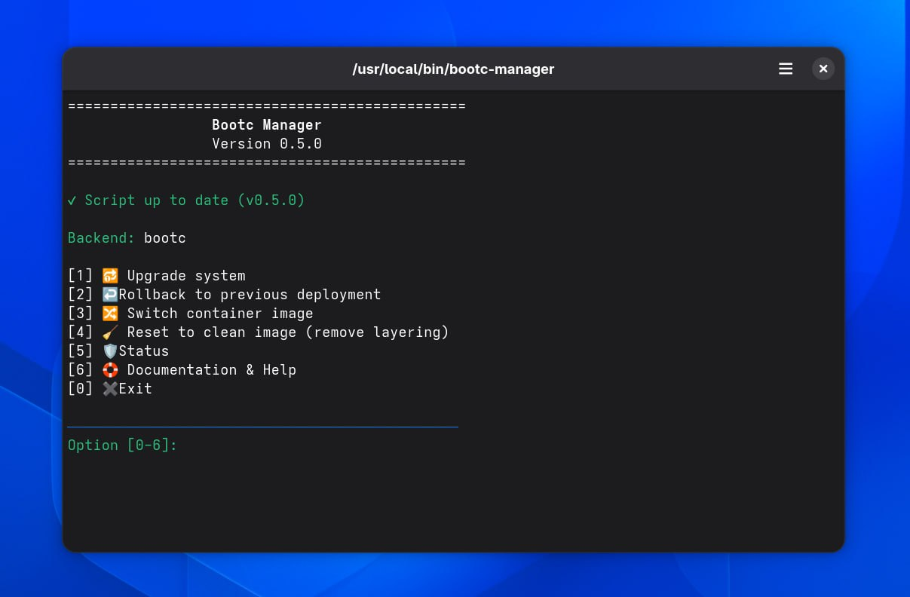

<p align="center">
  
</p>

<div align="center">
  <a href="https://fedoraproject.org/">
    
  </a>

  <a href="https://opensource.org/licenses/MIT">
    
  </a>
  
  <a href="https://www.gnu.org/software/bash/">
    
  </a>

  <a href="https://github.com/diogopessoa/bootc-manager/releases">
    
  </a>
</div>

---

**Bootc Manager** is a simple and intuitive command-line tool for [Bootc](https://bootc.dev/). It offers a user-friendly command line interface with management and maintenance options for Fedora Atomic and derivative systems.


## Key Features

- **Dual-Backend Support:** Native support for `bootc` (Fedora Atomic 45+) with seamless fallback to `rpm-ostree`.
- **System Upgrades & Rollbacks:** Trigger image updates or safely roll back to a previous deployment with confirmation prompts.
- **Image Switching (`bootc switch`):** Easily switch between desktop environments or custom OCI container images.
- **Layering Detection:** Automatically inspects and warns about local package layering (`rpm-ostree` mutations) that might conflict with `bootc` updates.
- **Configurable of bootc-manager.conf:** Allows you to configure the Bootc-Manager without complicating the standard workflow.
- **Desktop Integration:** Includes a `.desktop` shortcut for seamless execution directly from your application launcher.

## Screenshots

Main Menu:


## Requirements

* **Operating System:** Fedora Atomic 44+ and derivatives (Silverblue, Kinoite, Sericea, Aurora, Bazzite, etc.).
* **Core Tooling:** `bootc` and/or `rpm-ostree`.
  
## Quick Installation

Run the automated installer script in your terminal:

```bash
curl -fsSL https://raw.githubusercontent.com/diogopessoa/bootc-manager/main/install.sh | bash

```

Once installed, you can launch the application by:

1. Running `bootc-manager` in any terminal window, or
2. Searching for **Bootc-Manager** in your system application menu.


## bootc-manager.conf (still under development)

The `bootc-manager.conf` file can be used to configure Bootc-Manager without complicating the standard workflow. Can be configured in `/etc/bootc-manager.conf`, it will allow for options such as:

- choosing a preferred backend (bootc vs. rpm-ostree);
- enabling/disabling layering warnings;
- enable check-only

## File Destination Tree

This map shows where each file is placed on your system after running the installer:

```text
Destination Path
├── /usr/local/bin/bootc-manager                      # Main executable script
├── /etc/bootc-manager.conf                           # System-wide configuration file (optional)
├── ~/.local/share/icons/bootc-manager.svg            # User application icon
└── ~/.local/share/applications/bootc-manager.desktop # Application Menu shortcut
```

## Uninstallation

If you wish to completely remove **Bootc Manager** from your system, run the following command in your terminal:

```bash
sudo rm -f /usr/local/bin/bootc-manager /usr/share/applications/bootc-manager.desktop /etc/bootc-manager.conf && \
rm -f ~/.local/share/applications/bootc-manager.desktop \
     ~/.local/share/icons/bootc-manager.svg && \
echo "Bootc Manager has been successfully uninstalled."
```

## References & Links

* **Repository:** [github.com/diogopessoa/bootc-manager](https://github.com/diogopessoa/bootc-manager)
* **Documentation & Wiki:** [github.com/diogopessoa/bootc-manager/wiki](https://github.com/diogopessoa/bootc-manager/wiki)
* **Fedora User Guide:** [docs.fedoraproject.org/en-US/bootc](https://docs.fedoraproject.org/en-US/bootc/)


## License

This project is licensed under the [MIT License](https://www.google.com/search?q=LICENSE).
